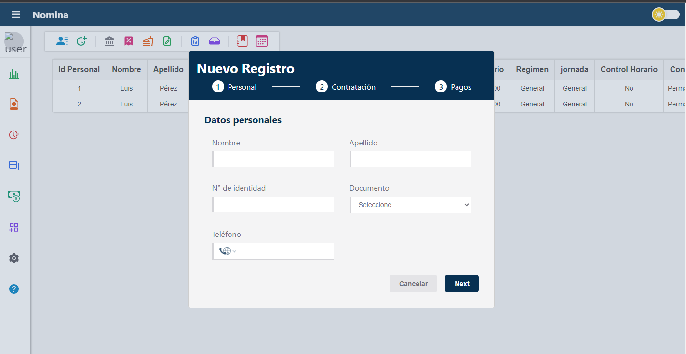

# Payroll App

## Project Description 📅

Payroll App is the frontend interface of an application designed to manage the payroll preparation for employees in a company. It allows for the registration, import, and management of time records, as well as other information necessary for payroll calculation. This includes personnel data, type of hiring, type of work schedule, salaries, payment account, and type of contract regimen. The interface facilitates the management of information related to the calculation period, such as vacations and advances, and provides visualization of payment reports, commands to generate reports and pay stubs, as well as the work schedule of employees.

## Screenshots / Demo 📸

[Link to the Application](https://nomina-web.vercel.app)  


## Technologies Used ⚙️

- JavaScript
- React
- Redux
- Vite
- Yarn
- GraphQL

### Utilities 🧰

- Prettier
- ESLint

## Installation 🛠️

Make sure to have [Yarn](https://yarnpkg.com/) installed. To install dependencies, run the following command from the project root:

```bash
yarn
```

## Project Usage 🚀

To build the application, use the following command:

```bash
yarn build
```

For development mode, use:

```bash
yarn dev
```

## Project Status 🚧

The project is in development. Currently, it is a portfolio project with no specific contribution guidelines defined.

## Contribution 🤝

Currently, the project is primarily intended as part of my portfolio, and no specific contribution guidelines have been established.

## License ⚖️

This project is distributed under the MIT License.
